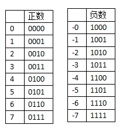
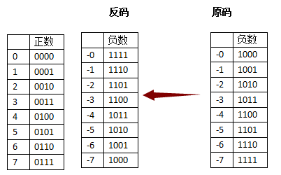
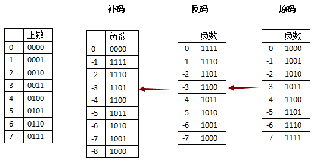

# C_Demos


### 1 变量
变量的名称可以由字母、数字和下划线字符组成。它必须以字母或下划线开头。大写字母和小写字母是不同的，因为 C 是大小写敏感。


### 2 注释

// 单行注释

/* 
 多行注释
 多行注释
 多行注释
 */
 
### 3 运算符

#### 3.1 算术运算符    

+	把两个操作数相加    
-	从第一个操作数中减去第二个操作数     	 
*	把两个操作数相乘    	 
/	分子除以分母   	 
%	取模运算符，整除后的余数    
++	自增运算符，整数值增加 1    
--	自减运算符，整数值减少 1   

#### 3.2 关系运算符

```
==	检查两个操作数的值是否相等，如果相等则条件为真。
!=	检查两个操作数的值是否相等，如果不相等则条件为真。
>	检查左操作数的值是否大于右操作数的值，如果是则条件为真。
<	检查左操作数的值是否小于右操作数的值，如果是则条件为真。
>=	检查左操作数的值是否大于或等于右操作数的值，如果是则条件为真。
<=	检查左操作数的值是否小于或等于右操作数的值，如果是则条件为真。
```


#### 3.3 赋值运算符

```
=	简单的赋值运算符，把右边操作数的值赋给左边操作数	C = A + B 将把 A + B 的值赋给 C
+=	加且赋值运算符，把右边操作数加上左边操作数的结果赋值给左边操作数	C += A 相当于 C = C + A
-=	减且赋值运算符，把左边操作数减去右边操作数的结果赋值给左边操作数	C -= A 相当于 C = C - A
*=	乘且赋值运算符，把右边操作数乘以左边操作数的结果赋值给左边操作数	C *= A 相当于 C = C * A
/=	除且赋值运算符，把左边操作数除以右边操作数的结果赋值给左边操作数	C /= A 相当于 C = C / A
%=	求模且赋值运算符，求两个操作数的模赋值给左边操作数	C %= A 相当于 C = C % A
<<=	左移且赋值运算符	C <<= 2 等同于 C = C << 2
>>=	右移且赋值运算符	C >>= 2 等同于 C = C >> 2
&=	按位与且赋值运算符	C &= 2 等同于 C = C & 2
^=	按位异或且赋值运算符	C ^= 2 等同于 C = C ^ 2
|=	按位或且赋值运算符	C |= 2 等同于 C = C | 2
```


#### 3.4 逻辑运算符

```
&&  称为逻辑与运算符。如果两个操作数都非零，则条件为真。
||  称为逻辑或运算符。如果两个操作数中有任意一个非零，则条件为真。
!  称为逻辑非运算符。用来逆转操作数的逻辑状态。如果条件为真则逻辑非运算符将使其为假。

&& 、 || 均会短路操作

&、|  不短路操作
```


```
int main ()
{
   int i1 = 1;
   int j1 = 1;
   if(++i1>0 || ++j1>0){  // || 短路操作，j1未 ++  
   
   	printf(" i1的值：%d\n", i1 );  //i1= 2
    printf(" j1的值：%d\n", j1 );  //j1 = 1
   } 
   
   int i2 = 1;
   int j2 = 1;
   if(++i2>0 | ++j2>0){   // |  不短路操作
   	printf(" i2的值：%d\n", i2 );  //i2= 2
    printf(" j2的值：%d\n", j2 );  //j2 = 2
   } 
   
   int i3 = 1;
   int j3 = 1;
   if(++i3<0 && ++j3>0){ //&& 短路操作， j3 未++ 
   	printf(" i3的值：%d\n", i3 );  // 
    printf(" j3的值：%d\n", j3 );  // 
   } else{
   		printf(" i3的值：%d\n", i3 );  //i3= 2
    	printf(" j3的值：%d\n", j3 );  //j3 = 1
   } 
   
   
   int i4 = 1;
   int j4 = 1;
   if(++i4<0 & ++j4>0){ //   &  不短路操作
   	printf(" i4的值：%d\n", i4 );  //
    printf(" j4的值：%d\n", j4 );  //
   }else{
   	printf(" i4的值：%d\n", i4 );  //i4= 2
    printf(" j4的值：%d\n", j4 );  //j4 = 2
   }
 
   return 0;
}
```


#### 3.5 位运算符

```
& ：按位与操作，按二进制位进行"与"运算，均为1 取1，否则为0；

| ： 按位或运算符，按二进制位进行"或"运算。有一个为1 取1，否则为0；

^ ： 异或运算符，按二进制位进行"异或"运算。相同为0，否则为1；

~ ： 取反运算符，按二进制位进行"取反"运算。

<< ：二进制左移运算符。将一个运算对象的各二进制位全部左移若干位（左边的二进制位丢弃，右边补0）。
>> ：二进制右移运算符。将一个数的各二进制位全部右移若干位，正数左补0，负数左补1，右边丢弃。


```


#### 3.6 杂项运算符

- sizeof()	返回变量的大小。 sizeof(a++),里面的a++并不会执行
- &	返回变量的地址。 &a; 将给出变量的实际地址。   
- *	指向一个变量。	 *a; 将指向一个变量。    
 


```
   int a = 4;
   short b;
   double c;
   int* ptr;
 
   /* sizeof 运算符实例 */
   printf("Line 1 - 变量 a 的大小 = %lu\n", sizeof(a) );  //4 
   printf("Line 2 - 变量 b 的大小 = %lu\n", sizeof(b) );  //2 
   printf("Line 3 - 变量 c 的大小 = %lu\n", sizeof(c) );  //8 
 
   /* & 和 * 运算符实例 */
   ptr = &a;    /* 'ptr' 现在包含 'a' 的地址 */
   printf("a 的值是 %d\n", a);  // 4 
   printf("*ptr 是 %d\n", *ptr); // 4 
```


### 4 判断

#### 4.1 if else语句
- if 语句可以嵌套
```
#include <stdio.h>
 
int main ()
{
   /* 局部变量定义 */
   int a = 100;
   int b = 200;
 
   /* 检查布尔条件 */
   if( a == 100 )
   {
       /* 如果条件为真，则检查下面的条件 */
       if( b == 200 )
       {
          /* 如果条件为真，则输出下面的语句 */
          printf("a 的值是 100，且 b 的值是 200\n" );
       }
   }
   printf("a 的准确值是 %d\n", a );
   printf("b 的准确值是 %d\n", b );
 
   return 0;
}


```


#### 4.2 switch
- switch 语句中的 expression 是一个常量表达式，必须是一个整型或枚举类型。

```
int main ()
{
   /* 局部变量定义 */
   char grade = 'B';
 
   switch(grade)
   {
   case 'A' :
      printf("很棒！\n" );
      break;
   case 'B' :
   case 'C' :
      printf("做得好\n" );
      break;
   case 'D' :
      printf("您通过了\n" );
      break;
   case 'F' :
      printf("最好再试一下\n" );
      break;
   default :
      printf("无效的成绩\n" );
   }
   printf("您的成绩是 %c\n", grade );
 
   return 0;
}

```

#### 4.3 三目运算符


```
(num%2==0)?printf("偶数"):printf("奇数");
```


### 5 循环

- while 循环 
- for 循环 
- do...while 循环

```
    int count = 0;
	int num = 23121333;
	count++;
	num/=10; 
	
	// 判断num是几位数
	while(num>0){
		count++;
		num/=10;
	}
	printf("结果为：%d",count);
 
    int n  ;
	scanf("%d",&n);
	int fact = 1;
 	int i=1;
 	for( i=1;i<=n;i++){
 		fact*= i;
	 }
	printf("结果为：%d",fact);
    return 0;
```

### 6 数据类型

#### 6.0 原码、反码、补码

原码：就是符号位加上真值的绝对值， 即用第一位表示符号，其余位表示值。
反码：正数的反码是其本身；负数的反码是在其原码的基础上，符号位不变，其余各个位取反。
补码：正数的补码就是其本身；负数的补码是在其原码的基础上，符号位不变， 其余各位取反， 最后+1。 (即在反码的基础上+1)
 

 | 十进制数 |	原码  |  反码  |  补码  |
 | :----: | :---- | :---- | :---- |
 | 9	| 0000 1001	| 0000 1001	| 0000 1001 |
 | -9	| 1000 1001 |	1111 0110 |	1111 0111 |

**反码、补码的诞生**
出处： https://www.zhihu.com/question/20159860
- 为表示正数 和 负数
左边第一位腾出位置，存放符号，正用0来表示，负用1来表示。



希望 （+1）和（-1）相加是0，但计算机只能算出0001+1001=1010 (-2);

- 引入反码
“反码”表示方式是用来处理负数的，符号位置不变，其余位置相反。



引入“反码”时，完美的解决了“正负相加等于0”的问题。
过去的（+1）和（-1）相加，变成了0001+1100=1111，刚好反码表示方式中，1111象征-0

- 引入补码


有两个零存在，+0（0000） 和 -0 （1111），引入了"补码"，同样是针对"负数"做处理的。
 "补码"的意思是，从原来"反码"的基础上，补充一个新的代码（反码+1）。
要处理"反码"中的"-0",当1111再补上一个1之后，变成了10000，丢掉最高位就是0000，刚好和左边正数的0，完美融合掉了。
这样就解决了+0和-0同时存在的问题另外"正负数相加等于0"的问题，
同样得到满足举例，3和（-3）相加，0011 + 1101 =10000，丢掉最高位，就是0000（0）。
同样有失必有得，我们失去了(-0) , 收获了（-8）。
二进制中，a的负数 -a，其补码为 2^n - a;使用补码和原码可以加出一个溢出的“零”


#### 6.1 整数类型

char	1 字节	   
short	2 字节   	 
int	    4 字节  ,取决于编译器（CPU），通常的意义是“1个字”	 
long	4/8 字节  ,取决于编译器（CPU），通常的意义是“1个字”
long long   8个字节

**整数越界**

11111111 + 1 = 100000000（溢出） -》 0     -1+1  =0 ；
01111111 + 1 = 10000000（越界） -》 -128      127+1  = -128

 -128-------1 0 ------127 -128

**整数输入输出**
-只有两种形式：int 或 long long
printf （%d，%u）
scanf（%ld，%lu）


#### 6.2 浮点类型

- float    4个字节，scanf（%f），printf（%f，%e）
- double   8个字节，scanf（%lf），printf（%f，%e）
- long double 16个字节
** 注意浮点数的精度问题**

```
float a,b,c;
	a = 1.345f;
	b = 1.123f;
	c = a + b;
	if(c == 2.468){
		printf("相等\n");
	} else{
		printf("不相等! c = %.10f,或%f\n",c,c);
	}
```

#### 6.3 字符类型
char  - 1个字节， scanf（%c），printf（%c）


转义序列	含义
\\	\ 字符
\'	' 字符
\"	" 字符
\?	? 字符
\a	警报铃声
\b	退格键
\f	换页符
\n	换行符
\r	回车
\t	水平制表符


#### 6.3 逻辑
bool c99支持

#### 6.4 指针
#### 6.5 自定义类型


#### 6.6 不同类型数据

- 表达范围不同，1个字节到16个字节
- 内存中表达形式：二进制（补码）/ 编码
- 输入输出时的格式：

#### 6.7 自动类型转换和强制类型转换

**自动类型转换**
char - short - int - long - long long
int - float - double
对于 printf，小于int 类型的会被转换为int，float转换为double；
但是 scanf不会，压输入short，使用 %hd


### 7 函数

```
return_type function_name( parameter list )
{
   body of the function
}

```

```
#include <stdio.h>

int add(int num1,int num2); //函数声明

int main ()
{
    int num = 99;
    int res = isPrime(num);
	printf("%d\n",res); //0 

	printf("%d",add(1,2)); //3
    return 0;
}

int add(int n1,int n2){
	return n1+n2;
}
int isPrime(int i){
	int res = 1;
	int k;
	for(k=2;k<i-1;k++){
		if(i%k==0){
			res = 0;
			break;
		}
	}
	return res;
} 
```


### 8 数组

- 声明数组  
double balance[10];   
 

- 初始化数组   
double balance[5] = {1000.0, 2.0, 3.4, 7.0, 50.0};

```
#include <stdio.h>

int add(int num1,int num2);  //函数声明

int main ()
{
 	int balance[5] = {1000, 2, 3, 7, 50};
 	int length = sizeof(balance)/sizeof(balance[0]);
 	printArray(balance,length);
 
    return 0;
}

 
int printArray(int arr[],int len){
 	
 	// 数组作为函数参数，其长度不能在函数内计算数组长度 
 	printf("函数内数组长度：%d\n",sizeof(arr)/sizeof(arr[0])); //2  
 	int i ;
 	for(i = 0;i<len;i++){
 		printf("%d\n",arr[i]);
	 }
} 
```
### 9 指针
指针：保存地址的变量

```
int i;
int *p = &i;

int* p ,q ;// 表示 p接受地址，q为int
int *p ,q ;// 表示 p接受地址，q为int

```


### scanf

- %d整型输出，%ld长整型输出 

- %o以八进制数形式输出整数，

- %x以十六进制数形式输出整数，或输出字符串的地址。

- %u以十进制数输出unsigned型数据(无符号数)。注意：%d与%u有无符号的数值范围，也就是极限的值，不然数值打印出来会有误。

- %c用来输出一个字符，

- %s用来输出一个字符串，

- %f用来输出实数(float/double)，以小数形式输出，默认情况下保留小数点6位。

- %.100f用来输出实数，保留小数点100位。

- %e以指数形式输出实数（float/double）。

- %p，输出指针
 


